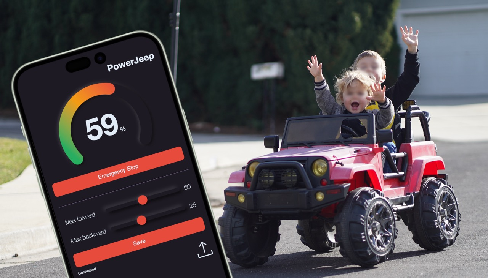
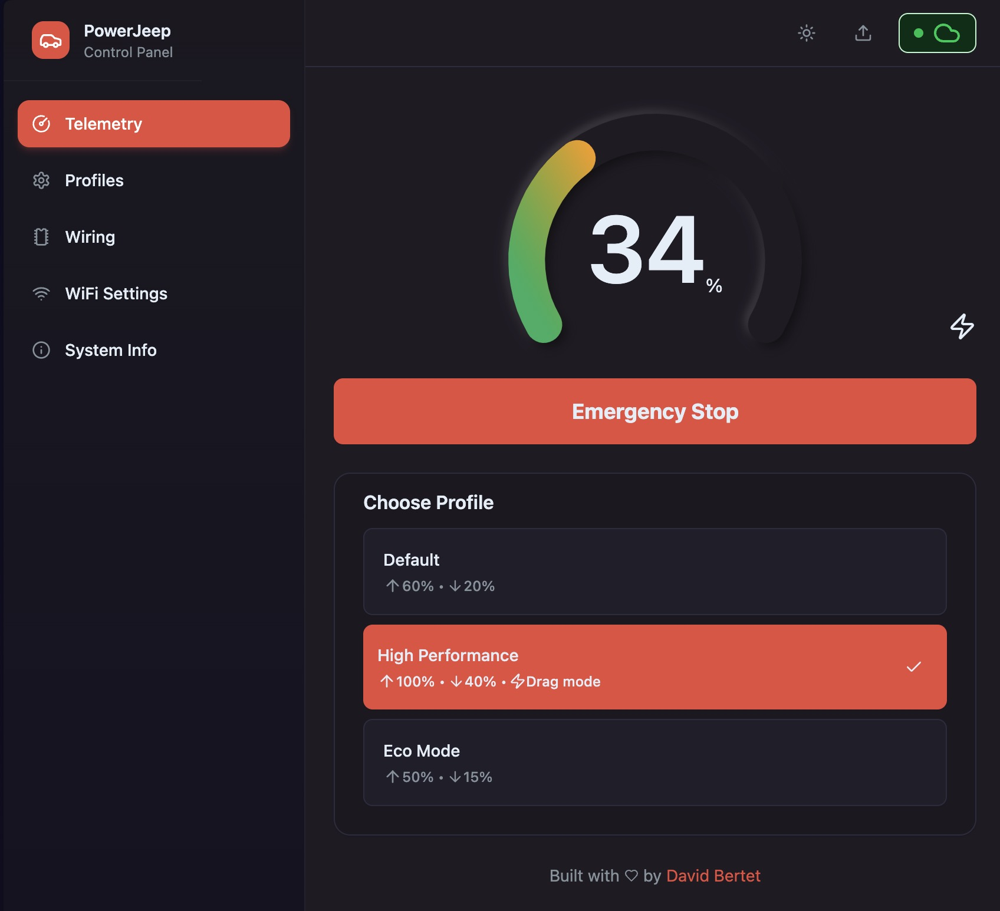
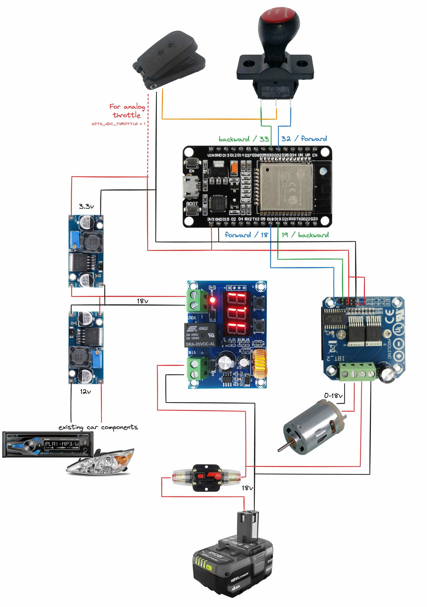

# PowerJeep: ESP32 Ride-On Car Controller

<div align="center">
  
  
  
</div><br/>

> Upgrade your electric ride-on car with an 18/20v power tool battery and ESP32-powered electronics for enhanced performance and control.

<div align="center">
   
</div>

## 🌟 Features

- **Power Tool Battery Conversion:** Upgrade your ride-on car's power source to an 18/20v power tool battery (Ryobi, DeWalt, Milwaukee, etc.) for extended runtime and enhanced performance
- **ESP32 Control:** Utilize the ESP32 microcontroller for precise control, monitoring, and remote safety features
- **Real-time Data Display:** Monitor speed, configure profiles, and control the car through a sleek web-based dashboard
- **Multiple Control Modes:** Support for both traditional dual-input or modern speed/direction control schemes, and digital/analog throttle
- **Battery Protection:** Built-in safeguards to prevent overuse and deep discharging
- **Mobile-Friendly Interface:** Fully responsive design for use on any device
- **OTA Updates:** Over-the-air firmware updates for future maintenance
- **CLI Tool:** Simple software installation and update process

⚠️ **Safety Warning:** This project can send up to 18-20V to your motor, when they are usually rated for 12V! The system ramps up power gradually to avoid gearbox damage, but be aware it can potentially damage your motor. Ensure proper airflow to keep components cool.
Drag mode enables quicker acceleration that may cause additional stress on the gearbox, drivetrain components, and motor.

Try the [web sample](https://davidbertet.github.io/PowerJeep/) to see what it is capable of!

[](https://davidbertet.github.io/PowerJeep/)

## ⚙️ Requirements

### Basic Requirements

- Ride-on car with a functional motor
- 18/20v power tool battery and charger (Ryobi, DeWalt, Milwaukee, etc.)
- 3D printer
- Basic hand tools (screwdriver, wire cutter/stripper, soldering iron)
- ESP32 development board
- PlatformIO (for backend build)
- Node.js & npm (for frontend build)

### Electronic Components

- 1x ESP32 [On Amazon](https://www.amazon.com/ESP-WROOM-32-Development-Microcontroller-Integrated-Compatible/dp/B08D5ZD528)
- 1x or 2x LM2596 - Voltage Regulator [On Amazon](https://www.amazon.com/gp/product/B08BLBYWN1)
- 1x XH-M609 - DC 12V-36V Voltage Protection Module [On Amazon](https://www.amazon.com/gp/product/B08X3HZ69D)
- 1x or 2x BTS7960 43A High Power Motor Driver Module [On Amazon](https://www.amazon.com/gp/product/B07TFB22H5)
- 1x 30A Circuit Breaker [On Amazon](https://www.amazon.com/gp/product/B096ZTV3CR)
- 12AWG wire high power circuit, electronic wire and connectors

**Optional:**

- 1x Throttle Pedal (permits precise throttle control, not just on/off) [On Amazon](https://www.amazon.com/KIMISS-Motorcycle-Accelerator-Throttle-Universal/dp/B07HMXLZ1H)

## 🔧 Assembly

### Hardware

- Print a mount for your battery (I used this [one](https://www.thingiverse.com/thing:4587319))
- Print the component support [Source available on OnShare](https://cad.onshape.com/documents/73e5cd159b60a9bf46e87dae/w/8d4b4ae9f68daee1281f112d/e/6d32cd17a65725a466bf965e?renderMode=0&uiState=64801221829a90766f018f83)
- Setup the XH-M609 to protect your battery when low (cutoff ~15.7V, reactivation ~17.5V)
- Setup the LM2596 by feeding 18V and turning the small screw until measuring 3.3V output (and another with 5V for your lights)
- Replace the throttle pedal (optional)

Here is the diagram with the different components. 3.3v doesn't need to be sent to the pedal for simple switch pedals.

<div align="center">
   
</div>

### 🚀 Software

1. **Clone the repository**

   ```shell
   git clone https://github.com/davidbertet/PowerJeep.git
   cd PowerJeep
   ```

2. **Install on your ESP32**

   Connect your ESP32 to your computer and install the drivers

   Then run the installation script

   ```shell
   ./install.sh
   ```

   And follow the instructions

3. **Setup the car**

- Connect to "PowerJeep" Wifi network (password "Rubicon!")
- Access 192.168.4.1 on your browser
- Go to "Wiring" tab to finish setting up your car

4. **Update over the air**

   ```shell
   git pull
   ./install.sh --ota <IP> --upload-password <PASSWORD>
   ```

## 🎮 Usage

- Turn on the circuit breaker and drive!
- Don't forget to turn the circuit breaker off when you are done
- **For advanced configuration:**
  - Connect your computer or mobile device to the Wi-Fi network emitted by the car
  - The captive portal should open automatically. If it doesn't, navigate to http://192.168.4.1
  - Use the interface to configure driving profiles, control modes, and view real-time speed
  - Emergency stop feature turns off the motor immediately for safety

# 🛠️ Tech Stack

- Lightweight Svelte frontend for fast performance
- ESP-IDF backend with static file serving
- Websocket interface for real-time updates

## 📝 Installation CLI

```shell
Usage: ./install.sh [OPTIONS]

Options:
  -o, --ota <IP>              Set OTA IP address for over-the-air updates
  -p, --upload-password <PWD> Set upload password for authentication
  -y, --yes                   Auto-confirm all prompts (non-interactive mode)
  -f, --frontend-only         Build/deploy frontend only
  -b, --backend-only          Build/deploy backend only
  -h, --help                  Show this help message
```

## 📁 Folder Architecture

```
PowerJeep/
├── frontend/    # Svelte web application
├── backend/     # ESP-IDF backend code
├── cli/         # CLI tool for install/update
└── assets/      # Additional media files
```

# Other

## 🤝 Contributing

Contributions are welcome!

If you have any ideas, improvements, or bug fixes, please submit a pull request. For major changes, please open an issue first to discuss potential updates.

## 📚 Documentation & Support

- [Issues](https://github.com/davidbertet/PowerJeep/issues)
- [Websocket Endpoint Guide](https://davidbertet.github.io/PowerJeep/WEBSOCKET_ENDPOINT.md)
- [LLM Integration Guide](https://davidbertet.github.io/PowerJeep/LLM_GUIDE.md)

## ⚖️ Liability & Insurance Considerations

**Important Legal Notice**: This modification significantly alters your ride-on car from its original manufacturer specifications. Please be aware:

- **Warranty Void**: Any modifications will likely void your manufacturer's warranty
- **Liability Risk**: As the modifier, you assume responsibility for any accidents, injuries, or property damage resulting from these modifications
- **Age Restrictions**: This project is intended for adult builders only. Modified vehicles should only be operated by children under direct adult supervision

**Disclaimer**: The creators of this project assume no responsibility for any damage, injury, or legal issues arising from the use of these plans. Build and use at your own risk.

## 📝 License

This project is licensed under the MIT License - see the [LICENSE](LICENSE) file for details.
